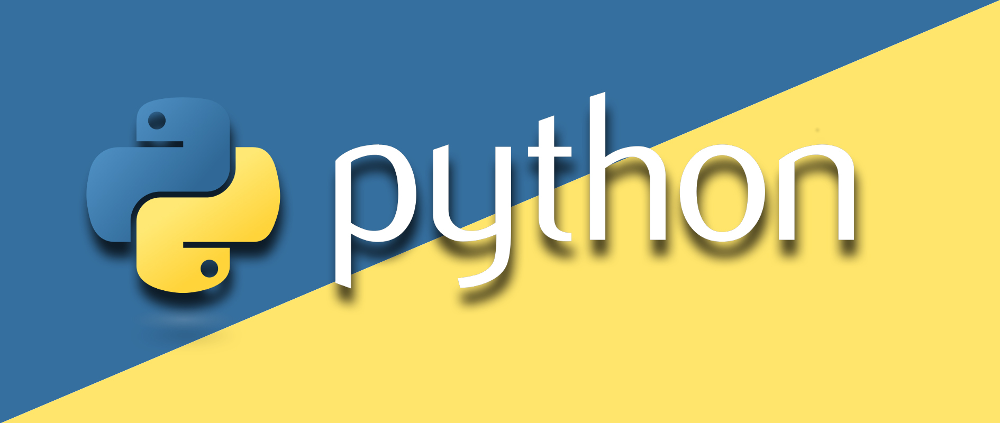
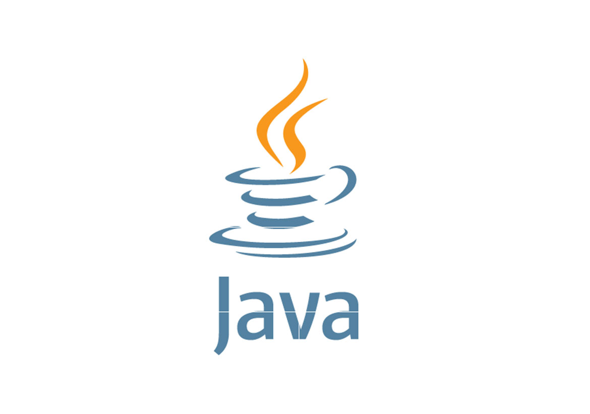
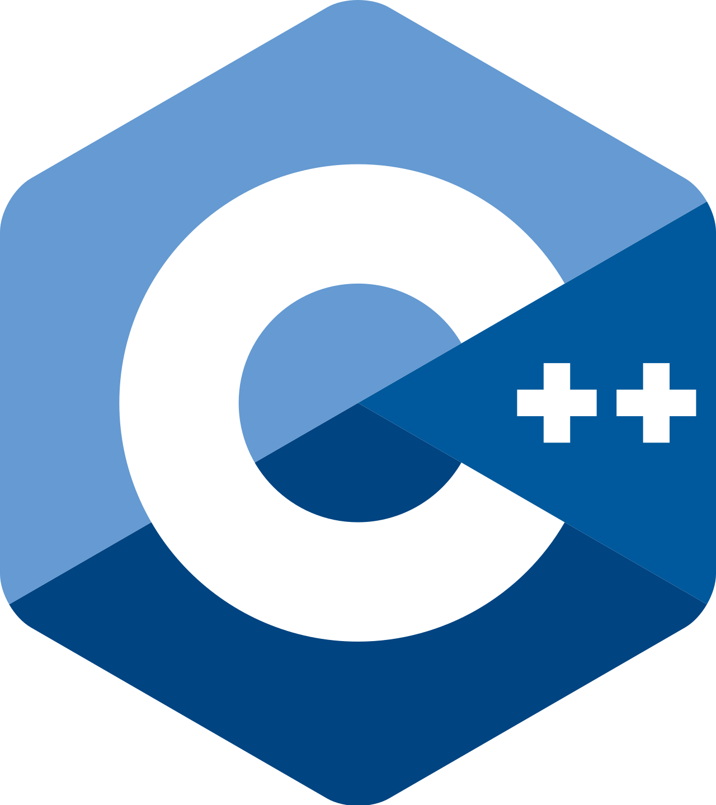
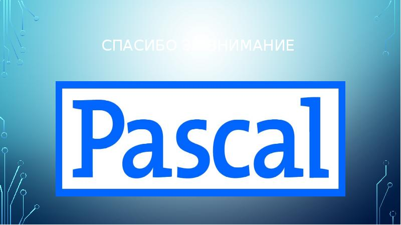
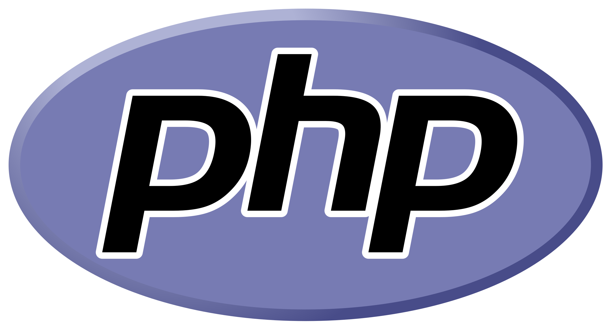

# Дипломная работа  
## По теме: Сложность в выборе языка для программирования.

## План моей работы:
 * Введение;
* Описание разных языков для программирования и их плюсы и минусы.(Основная часть);
* Заключение(Выводы).

# Введение
## Языки — это важнейшая составляющая индустрии программирования. Их часто обсуждают, критикуют, их, с течением времени, улучшают. На данный момент в мире насчитывается более 700 языков программирования. Но в своей работе я расскажу лишь о самых основных языках, которые знают все и об их истории.
# Основная часть

 ## Хотелось бы начать с языка Python и его истории:
 ## Задумка по реализации языка появилась в конце 1980-х годов, а разработка его реализации началась в 1989 году сотрудником голландского института CWI Гвидо ван Россумом. Для распределённой операционной системы Amoeba требовался расширяемый скриптовый язык, и Гвидо начал разрабатывать Python на досуге, позаимствовав некоторые наработки для языка ABC (Гвидо участвовал в разработке этого языка, ориентированного на обучение программированию). В феврале 1991 года Гвидо опубликовал исходный текст в группе новостей alt.sources. С самого начала Python проектировался как объектно-ориентированный язык.

## Гвидо ван Россум назвал язык в честь популярного британского комедийного телешоу 1970-х «Летающий цирк Монти Пайтона», поскольку автор был поклонником этого телешоу, как и многие другие разработчики того времени, а в самом шоу прослеживалась некая параллель с миром компьютерной техники.

## Наличие дружелюбного, отзывчивого сообщества пользователей считается, наряду с дизайнерской интуицией Гвидо, одним из факторов успеха Python. Развитие языка происходит согласно чётко регламентированному процессу создания, обсуждения, отбора и реализации документов PEP (англ. Python Enhancement Proposal) — предложений по развитию Python.

## 3 декабря 2008 года, после длительного тестирования, вышла первая версия Python 3000 (или Python 3.0, также используется сокращение Py3k). В Python 3000 устранены многие недостатки архитектуры с максимально возможным (но не полным) сохранением совместимости со старыми версиями Python.

## Дата окончания срока поддержки Python 2.7 первоначально была установлена на 2015 год, а затем перенесена на 2020 год из опасения, что большая часть существующего кода не может быть легко перенесена на Python 3. Поддержка Python 2 была направлена лишь на уже существующие проекты, новые проекты должны были использовать Python 3. Официально Python 2.7 не поддерживается с 1 января 2020 года, хотя последнее обновление вышло в апреле 2020. Больше никаких исправлений безопасности или других улучшений для Python 2.7 не будет выпущено. С окончанием срока службы Python 2.x поддерживаются только Python 3.6.x и более поздние версии.
# Области в которых используют данный язык:
* Веб-разработка;
* Машинное обучение;
* Интернет вещи;
* Проекты с ИИ, нейросети;
* Data Science, аналитика; 
* некоторы игры.
# Плюсы и минусы языка
## Плюсы:
* Хорошо подходит для новичков(один из лучших языков для начинающих);

* Простой минималистичный синтаксис: код легко писать, читать и поддерживать;

* Большая стандартная библиотека и много дополнительных библиотек;
* Большой выбор фреймворков;

* Поддерживает объектно-ориентированное программирование и другие парадигмы;
* Кроссплатформенность и поддержка почти всех современных систем;
* Язык пишет где у вас ошибка и какая ошибка.
## Минусы:
* Низкая скорость;
* Плохо подходит для разработки мобильных приложений;
* Из-за динамической типизации выше вероятность ошибки при запуске, нужно больше тестов;
* Не подходит для работы с памятью на низком уровне.
# Второй язык

## Изначально язык назывался Oak («Дуб»), разрабатывался Джеймсом Гослингом для программирования бытовых электронных устройств. Из-за того, что язык с таким названием уже существовал, Oak был переименован в Java. Назван в честь марки кофе Java, которая, в свою очередь, получила наименование одноимённого острова (Ява), поэтому на официальной эмблеме языка изображена чашка с горячим кофе. Существует и другая версия происхождения названия языка, связанная с аллюзией на кофемашину как пример бытового устройства, для программирования которого изначально язык создавался. В соответствии с этимологией в русскоязычной литературе с конца двадцатого и до первых лет двадцать первого века название языка нередко переводилось как Ява, а не транскрибировалось.

## В результате работы проекта мир увидел принципиально новое устройство, карманный персональный компьютер Star7, который опередил своё время более чем на 10 лет, но из-за большой стоимости в 50 долларов не смог произвести переворот в мире технологии и был забыт.

## Устройство Star7 не пользовалось популярностью, в отличие от языка программирования Java и его окружения. Следующим этапом жизни языка стала разработка интерактивного телевидения. В 1994 году стало очевидным, что интерактивное телевидение было ошибкой.

## С середины 1990-х годов язык стал широко использоваться для написания клиентских приложений и серверного программного обеспечения. Тогда же определённое распространение получила технология Java-апплетов — графических Java-приложений, встраиваемых в веб-страницы; с развитием возможностей динамических веб-страниц в 2000-е годы технология стала применяться редко.

## В веб-разработке применяется Spring Framework; для документирования используется утилита Javadoc.
# Что пишут на Java:
* приложения для Android — Java практически единственный язык для них;
* десктопные приложения;
* промышленные программы;
* банковские программы;
* научные программы;
* программы для работы с Big Data;
* веб-приложения, веб-сервера, сервера приложений;
* встроенные системы — от маленьких чипов до специальных компьютеров;
* корпоративный софт.
# Плюсы и минусы
## Плюсы: 
* Независимость — ваш код будет работать на любой платформе, которая поддерживает Java;
* Надёжность — в немалой мере достигается благодаря строгой статической типизации;
* Мультифункциональность;
* Сравнительно простой синтаксис;
* Java — основной язык для Android-разработки;
* Объектно-ориентированное программирование (ООП) тоже приносит много выгод;
* параллельная разработка;
* гибкость;
* одни и те же классы можно использовать много раз;
* код хорошо организован, и его легче поддерживать.
## Минусы:
* Низкая скорость (по сравнению с С и С++);
* Требует много памяти;
* Нет поддержки низкоуровневого программирования (Java — высокоуровневый язык). Например, у неё нет указателей;
* С 2019 года обновления для бизнеса и коммерческого использования стали платными;
* Для ООП нужен опыт, а планирование новой программы занимает много времени.
# Третий язык

## Язык возник в начале 1980-х годов, когда сотрудник фирмы Bell Labs Бьёрн Страуструп придумал ряд усовершенствований к языку C под собственные нужды. Когда в конце 1970-х годов Страуструп начал работать в Bell Labs над задачами теории очередей (в приложении к моделированию телефонных вызовов), он обнаружил, что попытки применения существующих в то время языков моделирования оказываются неэффективными, а применение высокоэффективных машинных языков слишком сложно из-за их ограниченной выразительности. Так, язык Симула имеет такие возможности, которые были бы очень полезны для разработки большого программного обеспечения, но работает слишком медленно, а язык BCPL достаточно быстр, но слишком близок к языкам низкого уровня и не подходит для разработки большого программного обеспечения.

## Вспомнив опыт своей диссертации, Страуструп решил дополнить язык C (преемник BCPL) возможностями, имеющимися в языке Симула. Язык C, будучи базовым языком системы UNIX, на которой работали компьютеры Bell, является быстрым, многофункциональным и переносимым. Страуструп добавил к нему возможность работы с классами и объектами. В результате практические задачи моделирования оказались доступными для решения как с точки зрения времени разработки (благодаря использованию Симула-подобных классов), так и с точки зрения времени вычислений (благодаря быстродействию C). В первую очередь в C были добавлены классы (с инкапсуляцией), наследование классов, строгая проверка типов, inline-функции и аргументы по умолчанию. Ранние версии языка, первоначально именовавшегося «C with classes» («Си с классами»), стали доступны с 1980 года.

## Разрабатывая C с классами, Страуструп написал программу cfront — транслятор, перерабатывающий исходный код C с классами в исходный код простого C. Это позволило работать над новым языком и использовать его на практике, применяя уже имеющуюся в UNIX инфраструктуру для разработки на C. Новый язык, неожиданно для автора, приобрёл большую популярность среди коллег и вскоре Страуструп уже не мог лично поддерживать его, отвечая на тысячи вопросов.

## К 1983 году в язык были добавлены новые возможности, такие как виртуальные функции, перегрузка функций и операторов, ссылки, константы, пользовательский контроль над управлением свободной памятью, улучшенная проверка типов и новый стиль комментариев (//). Получившийся язык уже перестал быть просто дополненной версией классического C и был переименован из C с классами в «C++». Его первый коммерческий выпуск состоялся в октябре 1985 года.

## До начала официальной стандартизации язык развивался в основном силами Страуструпа в ответ на запросы программистского сообщества. Функцию стандартных описаний языка выполняли написанные Страуструпом печатные работы по C++ (описание языка, справочное руководство и так далее). Лишь в 1998 году был ратифицирован международный стандарт языка C++: ISO/IEC 14882:1998 «Standard for the C++ Programming Language»; после принятия технических исправлений к стандарту в 2003 году — следующая версия этого стандарта — ISO/IEC 14882:2003.
# Области использования
* разработка игр и игровых движков (Unreal Engine, Unity);
* GPU-вычисления (cryptocurrency, deep learning);
* разработка высоконагруженных и высокопроизводительных приложений.
# Плюсы и минусы 
## Плюсы:
* Высокая производительность, потому что он не накладывает никакой избыточной нагрузки на программу, не использующую какие-либо возможности;
* Поддержка множества стилей программирования (процедурное программирование, абстракцию данных, объектно-ориентированное программирование и обобщенное программирование). Поэтому разработчик может сам выбрать, в каком стиле ему писать программу;
* Большое сообщество.
## Минус:
* Высокий порог входа. Решения об изменениях в C++ принимают на заседаниях комитета, участие в которых формально может принять любой разработчик. Но отправляться на такие собрания в другую страну за свой счет трудно, поэтому большинство участников — представители крупных IT-корпораций, таких как Google, Яндекс. А вот представителей интересов студентов или стартапов немного. Поэтому эксперты могут принять концепции, которые им кажутся очевидными, а для остальной аудитории они будут сложными.
# Четвертый язык

## Язык программирования Pascal был создан в 1970 году на основе языка Алгол-60.

## Pascal создавался Никлаусом Виртом в 1968—1969 годах после его участия в работе комитета разработки стандарта языка Алгол-68. Язык назван в честь французского математика, физика, литератора и философа Блеза Паскаля, который создал одну из первых в мире механических машин, складывающую два числа. Первая публикация Вирта о языке датирована 1970 годом; представляя язык, автор в качестве цели его создания указывал построение небольшого и эффективного языка, способствующего хорошему стилю программирования, использующему структурное программирование и структурированные данные.

## Последующая работа Вирта была направлена на создание на основе Паскаля языка системного программирования с сохранением возможности вести на его базе систематический, целостный курс обучения профессиональному программированию: «The guiding idea was to construct a genuine successor of Pascal meeting the requirements of system engineering, yet also to satisfy my teacher’s urge to present a systematic, consistent, appealing, and teachable framework for professional programming.». Результатом этой работы стал язык Модула-2, после которого Вирт занялся разработкой объектно-ориентированного языка программирования Oberon на основе всех предыдущих разработок[.

## Одной из целей создания языка Паскаль Никлаус Вирт считал обучение студентов структурному программированию. До сих пор Паскаль заслуженно считается одним из лучших языков для начального обучения программированию. Его современные модификации, такие как Object Pascal, широко используются в промышленном программировании (среда Delphi). Также на основе синтаксиса языка Паскаль создан язык программирования Structured Text (ST) или Structured Control Language (SCL) для программируемых логических контроллеров.

## К 1990-м годам Pascal стал одним из наиболее распространённых в мире алгоритмических языков программирования. Ведущие разработчики программного обеспечения регулярно выпускали новые версии своих компиляторов для этого языка. Популярные компиляторы того времени: Turbo Pascal (разработан компанией Borland), Microsoft Pascal Compiler, Quick Pascal, Pascal-2, Professional Pascal, USCD Pascal.
# Области использования
* в бизнесе с их помощью в 90-е и 2000-е годы разрабатывались средства автоматизации производственных процессов. Некоторые компании пользуются ими по сей день, хотя в последние годы более популярно ПО, написанное на языках Python, Java, 1С и т.д.;
* в промышленности на Object Pascal, Turbo Pascal и Delphi широко применялись и ограниченно применяются до сих пор для программирования оборудования, оснащенного микроконтроллерами;
* современные диалекты Pascal и разработанные на его основе языки используются некоторыми производителями домашних ТВ-приставок и других электронных бытовых устройств для написания приложений.
# Плюсы и минусы 
## Плюсы:
* Универсален Распространен в школах;
* После Паскаля легко перейти на Си; 
* Минималистичен;
* Подходит для обучения; 
* Надежность разрабатываемых программ; 
* Паскаль лежит в основе языка ST, который используется для создания программ для ПЛК (программируемый логический контроллер). ПЛК, в свою очередь, используются в автоматизации производства. 
## Минусы:
* Ограниченное взаимодействие с компонентами, написанными на других языках программирования;
* Из-за своей универсальности менее приспособлен для решения некоторых задач, чем более специализированные языки;
* Ограниченные возможности работы с динамической памятью, массивами переменной длины, отсутствие раздельной компиляции и т.д.
# Пятый язык 

## В 1994 году датский программист Расмус Лердорф разработал на C набор CGI-скриптов для учёта посетителей его онлайн-резюме, обрабатывающий шаблоны HTML-документов. Лердорф назвал набор Personal Home Page Tools (Инструменты для личной домашней страницы). Вскоре функциональности перестало хватать, и Лердорф разработал новый интерпретатор шаблонов PHP/FI (англ. Personal Home Page / Forms Interpreter — «персональная домашняя страница / интерпретатор форм»).

## 8 июня 1995 года вышел Personal Home Page (PHP Tools) version 1.0 — первый публичный релиз.

## В 1997 году после длительного бета-тестирования вышла вторая версия обработчика, написанного на C — PHP/FI 2.0. Её использовали около 1 % (приблизительно 50 тысяч) всех интернет-доменов мира.

## Версия PHP 3.0 подверглась значительной переработке, определившей современный облик и стиль языка программирования. В 1997 году два израильских программиста, Энди Гутманс и Зеев Сураски, полностью переписали код интерпретатора. PHP 3.0 был официально выпущен в июне 1998 года.

## Одной из сильнейших сторон PHP 3.0 была возможность расширения ядра дополнительными модулями. Впоследствии интерфейс написания расширений привлёк к PHP множество сторонних разработчиков, работающих над своими модулями, что дало PHP возможность работать с огромным количеством баз данных, протоколов, поддерживать большое число API. Большое количество разработчиков привело к быстрому развитию языка и стремительному росту его популярности. С этой версии акроним php расшифровывается как «PHP: hypertext Preprocessor», вместо устаревшего «Personal Home Page».

## К зиме 1998 года, практически сразу после официального выхода PHP 3.0, Энди Гутманс и Зеев Сураски начали переработку ядра PHP. В задачи входило увеличение производительности сложных приложений и улучшение модульности базиса кода PHP. Новый движок, названный Zend Engine, успешно справлялся с поставленными задачами и впервые был представлен в середине 1999 года. PHP 4.0, основанный на этом движке и принёсший с собой набор дополнительных функций, официально вышел в мае 2000 года. В дополнение к улучшению производительности, PHP 4.0 имел ещё несколько ключевых нововведений, таких как поддержка сессий, буферизация вывода, более безопасные способы обработки вводимой пользователем информации и несколько новых языковых конструкций.

## Пятая версия PHP была выпущена разработчиками 13 июля 2004 года. Изменения включают обновление ядра Zend (Zend Engine 2), что существенно увеличило эффективность интерпретатора. Введена поддержка языка разметки XML. Полностью переработаны функции ООП, которые стали во многом схожи с моделью, используемой в Java. В частности, введён деструктор, открытые, закрытые и защищённые члены и методы, окончательные члены и методы, интерфейсы и клонирование объектов. В последующих версиях также были введены пространства имён, замыкания и целый ряд достаточно серьёзных изменений, количественно и качественно сравнимых с теми, которые появились при переходе на PHP 5.0.

## Шестая версия PHP разрабатывалась с октября 2006 года. Было сделано множество нововведений, как, например, исключение из ядра регулярных выражений POSIX и «длинных» суперглобальных массивов, удаление директив safe_mode, magic_quotes_gpc и register_globals из конфигурационного файла php.ini. Одним из основных новшеств должна была стать поддержка Юникода. Однако в марте 2010 года разработка PHP6 была признана бесперспективной из-за сложностей с поддержкой Юникода. Исходный код PHP6 перемещён на ветвь, а основной линией разработки стала версия 5.4.

# PHP 7
## В 2014 году было проведено голосование, по результатам которого следующая версия получила название PHP 7. Выход новой версии планировался в середине октября 2015 года. В марте 2015 года Zend представили инфографику, в которой описаны основные нововведения PHP 7.

## 3 декабря 2015 года было объявлено о выходе PHP версии 7.0.0.

## Новая версия основывается на экспериментальной ветви PHP, которая изначально называлась phpng (англ. PHP Next Generation «следующее поколение»), и разрабатывалась с упором на увеличение производительности и уменьшение потребления памяти. В новой версии добавлена возможность указывать тип возвращаемых из функции данных, добавлен контроль передаваемых типов для данных, а также новые операторы.

## 13 июня 2019 вышла версия PHP 7.4. В ядро были добавлены типизированные свойства и стрелочные функции, а также ограниченная ковариантность возвращаемого типа и контравариантность типа аргумента.

# PHP 8
## PHP версии 8.0 была выпущена 26 ноября 2020-го. Главными нововведениями стали: поддержка union-типов, JIT-компиляция и атрибуты (также известны как аннотации), также «конструкция» switch была заменена на «выражение» match и был добавлен новый оператор Nullsafe.

## 9 июля 2020 года Дэйл Хирт (англ. Dale Hirt), менеджер проекта PHP в Microsoft, в рассылке php.internals выпустил сообщение о том, что после выпуска версии PHP 8.0 Microsoft прекратит поддержку разработки этого языка программирования для Windows. Специалисты Microsoft занимались компиляцией бинарных версий интерпретатора для ОС Windows и тестированием их безопасности. В сообществе разработчиков PHP сообщили, что примут все необходимые меры, чтобы найти в ближайшее время альтернативный вариант для организации поддержки PHP 8.0 и выше для Windows, например, своими силами.
# Области использования 
* Автоматическое извлечение POST- и GET-параметров, а также переменных окружения веб-сервера в предопределённые массивы;
* Взаимодействие с большим количеством различных систем управления базами данных через дополнительные модули (MySQL, MySQLi, SQLite, PostgreSQL, Oracle Database (OCI8), Microsoft SQL Server, Sybase, ODBC, mSQL, IBM DB2, Cloudscape и Apache Derby, Informix, Ovrimos SQL, Lotus Notes, DB++, DBM, dBase, DBX, FrontBase, FilePro, Ingres II, SESAM, Firebird и InterBase, Paradox File Access, MaxDB, интерфейс PDO, Redis);
* Автоматизированная отправка HTTP-заголовков;
* Работа с HTTP-авторизацией;
* Работа с cookies и сессиями;
* Работа с локальными и удалёнными файлами, сокетами;
* Обработка файлов, загружаемых на сервер;
* Работа с XForms;
* Создание и работа с API;
* Создание приложение с графическим интерфейсом пользователя при использовании Фреймворка Qt Designer;
* Создание консольных приложений.
# Плюсы и минусы
## Плюсы:
* PHP бесплатный, а его код лежит в открытом доступе.
* Для PHP создано множество библиотек, баз данных и фреймворков;
* PHP совместим почти со всеми современными серверами;
* PHP гибкий и даёт много свободы;
* PHP хорош для новичков, ему легко научиться;
* Простая и элегантная система классов и объектов;
* Простой синтаксис.
## Минусы:
* Чтобы работать с PHP, нужно знать как минимум HTML, а лучше ещё и CSS. Знание JavaScript тоже пригодится;
* У простоты и гибкости PHP тоже есть обратная сторона: написать плохой код очень просто, ошибиться легко, а найти ошибку тяжело. Из-за этого поддерживать код бывает непросто;
* Безопасность. Во-первых, проблему создаёт то, что код лежит в открытом доступе: если кто-то найдёт в коде баг, он может использовать это в своих целях. Во-вторых, из-за простоты языка и большого количества разработчиков код часто низкого качества и в нём не предусмотрена защита;
* Скорость. PHP не самый производительный язык: например, его конкурент Javascript — быстрее;
* Нет четкой системы в названиях функций стандартной библиотеки: в некоторых есть сокращения, в некоторых нет (call_user_func vs. create_function). В некоторых есть подчёркивание, в некоторых нет (isset vs. is_null), а, например, в названиях функций для работы со строками иногда бывает обозначение str, а иногда его не бывает. Такая нестабильность усложняет работу.
# Заключение
## В заключении хотелось бы сказать, что у языков есть свои определенные преимущества, плюсы и минусы. Трудно сказать какой язык стоит использовать, потому что нужна четкая цель и понимание, каков будет ваш конечный продукт. Каждый язык лучше подходит для своей сферы использования(игры, сайты, приложения и т.д.). Но для ознакомления с языками лучше начать с языка Python, ведь он прост в использовании и у него нет жестких рамок(например как в Java), а также программа поможет и укажет на вашу ошибку в коде.

